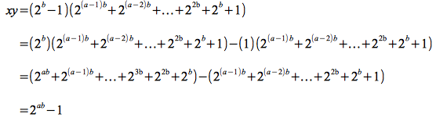

Most of the math courses you have taken to this point, e.g. algebra,
trigonometry, calculus, etc., involve computations on numerical values
usually in the context of *continuous* mathematical functions.
**Discrete math** is the branch of mathematics that focuses on writing
*proofs* using *deductive reasoning* rather than computation. In
constructing proofs, we will *logically deduce* a truth of a statement
based on the relationships of other (assumed) true statments. These
proofs will deal not only with numbers (number theory) but also sets,
relations, functions, etc. We will explore several common paradigm proof
templates and see how they can be applied to many different areas of
mathematics through the proper application of *formal logic*.

Proofs
======

The foundation of proofs involves stating several **statements** (which
are sentences that are *either* **true** or **false**) known as
**assumptions** (or **premises** or **givens**) that are taken as true
and then through a process of logical deduction a true **conclusion** is
found. This conclusion may then be used as an additional assumption for
further deductive exploration. While intuitively this thought process
seems quite straightforward, often the statements take a variety of
forms that may need to be rewritten in a more useful form through
*logical equivalencies*. Unfortunately, the only way to become
proficient at writing proofs is to *practice, practice, practice*.
Luckily there are several common proof techniques that can serve as a
roadmap to successfully creating a valid proof.

Examples of Proofs
==================

**Prime Numbers**

To demonstrate a few example proofs, we will use the mathematical
concept of *prime numbers*.

> **Definition**

> > A *prime number* is a integer greater than 1 that cannot be written as a product of two smaller positive integers.

For example, the value 7 is *prime* but the value 9 is *not prime*
(since it can be written as 3*3).

Consider the values computed by (2n - 1) where *n* = 1, 2, 3, \...

>  n | prime?  | 2n - 1         | prime?      |
> ---| ------- | ------------------------- | ----------- |
>  2 | **yes** | 22 - 1 = 3     | **yes**     |
>  3 | **yes** | 23 - 1 = 7     | **yes**     |
>  4 | no      | 24 - 1 = 15    | no (3\*5)   |
>  5 | **yes** | 25 - 1 = 31    | **yes**     |
>  6 | no      | 26 - 1 = 63    | no (7\*9)   |
>  7 | **yes** | 27 - 1 = 127   | **yes**     |
>  8 | no      | 28 - 1 = 255   | no (15\*17) |
>  9 | no      | 29 - 1 = 511   | no (7\*73)  |
> 10 | no      | 210 - 1 = 1023 | no (31\*33) |

From the table above we see an interesting pattern emerging - for each
number that is prime, 2n - 1 is also prime (these types of prime
numbers are known as *Mersenne primes*). Intuitively we would like to
*conjecture* (i.e. state without proof) that the pattern will continue
*for all prime numbers*. We also see that for those values that are
*not* prime, 2n - 1 is also *not* prime. Again we intuitively would
like to conjecture that this pattern will also continue. However the
above table **does not PROVE** either conjecture to be true *for all
integers greater than one* (in fact it only proves the conjectures for
the integers from 2-10). Thus the question becomes how would we go about
proving (or disproving) the conjectures to be true (or false)?

*Conjecture 1*

> Suppose *n* is an integer greater than 1 that is a prime number, then 2n - 1 is prime.

This conjecture turns out to be false by considering the value *n* = 11
⇒ 211 - 1 = 2047 = 23 \* 89! Thus we have *disproven* the conjecture
by giving (a single) *counterexample*. It turns out that there are many
other counterexamples that exist, but to disprove the conjecture we only
need to give *any one of them*.

*Conjecture 2*

> Suppose *n* is an integer greater than 1 that is *not* a prime number, then 2n - 1 is *not* prime.

To prove this conjecture we return to the definition of prime numbers.

Since *n* is *not* prime, there exist two smaller integers whose product
equals *n*. Let these integers be denoted by *a* and *b* (formally 1 \<
*a* \< *n* and 1 \< *b* \< *n*), such that *a*\**b* = *n*. We must now
find two other positive integers *x* and *y* such that *x*\**y* = 2n -
1 = 2ab - 1 (it can be shown that since *n* is an integer that 2n -
1 is an integer). At this point experience, an educated guess, and often
a little luck will lead us to the factors we are looking for. Assume *x*
= 2b - 1 and *y* = 2(a-1)b + 2(a-2)b + \... + 22b + 2b + 1.
Then

> 

At this point we would be tempted to claim that we have proven the
conjecture since we have found two factors whose product is 2n - 1.
However we have not proven **every part** of the definition of a prime
number. In particular, to show 2n - 1 is not prime we *also need to
prove that* 1 < *x* < 2n -1 and 1 < *y* < 2n - 1 (i.e. that the
factors are integers greater than one and less than our value).

Since *b* < *n* ⇒ 2b < 2n ⇒ *x* = 2b - 1 < 2n - 1. Clearly
since *b* > 1 ⇒ *x* = 2b - 1 > 1. Thus we have proven that 1 < *x*
< 2n - 1.

Since *y* = 1 + \... it is obvious that *y* > 1. Finally since *y* > 1
and we have already shown that *x* > 1 ⇒ *y* < *x*\**y* ⇒ *y* < 2n - 1 completing the proof.

The important point illustrated by this proof is that we must be sure to
prove **all** the parts of the proof and not **assume** that some of the
parts are automatically true. However once we have *proven* a conjecture
(creating a *theorem*) we may use the theorem in subsequent proofs as a
known truth to avoid repeating the same procedure.

These two conjectures (the first of which is false and the second of
which is true) lead to other interesting questions regarding prime
numbers. For example, we know that simply because *n* is a prime does
not guarantee that 2n - 1 is a prime, but is there a point after which
*no* primes produce a prime of the form 2n - 1?

A related question that is even more interesting is whether or not there are an *infinite*
number of primes? 

Clearly when we start asking questions regarding infinite sets, we cannot exhaustively check every element of the set, i.e. we cannot check every possible number to determine if there are only a finite number of primes. Luckily deductive reasoning can come to the rescue in many of these cases to either prove or disprove conjectures about infinite sets.

*Conjecture 3*

> There are infinitely many prime numbers.

To construct this proof we will create an assumption that is the
opposite of what we wish to prove and then show that the assumption must
be false (therefore proving that the original conjecture is true).
Assume there are a finite number of primes *n* denoted {*p*1, *p*2,
\..., *p*n} and let *m* be the product of all the primes plus 1 ⇒ *m*
= *p*1\**p*2\*\...\**p*n + 1. Since every integer is either prime
or not, *m* must either be prime or not. Thus we consider the two cases
separately.

Case 1: Assume *m* is prime.

Since *m* > *p*i for *i* = 1, 2, \..., *n*, *m* would be a prime
larger than any of the original primes thus contradicting the assumption
that there are only *n* prime numbers. Therefore *m* must not be prime.

Case 2: Assume *m* is not prime.

Since *m* is not prime, it must be factorable by a prime number (known
as prime factorization which we will prove later). However clearly *m*
is not divisible by any of the primes *p*1, *p*2, \..., *p*n since
it would give a remainder of 1. Thus *m* cannot be factored into primes
and thus must be a prime.

The only way both Case 1 and Case 2 can simultaneously be false is if
the original assumption that there are only a finite number of primes is
false. Therefore there must be an infinite number of primes.

Summary
=======

The above examples demonstrate several basic proof techniques.

-   To *disprove* a conjecture, one only needs to give a single
    *counterexample*.
-   A *constructive* proof gives a method for verifying the conjecture
    for any particular values. For example given any non-prime number
    *n*, simply *construct* *x* and *y* as given in the proof to produce
    two factors for 2n - 1 showing that it is not prime.
-   A *non-constructive* proof simply disproves the negation of the
    conjecture (thus proving the conjecture) but does not provide a
    procedure to verify any particular values. For example while we have
    proven that there are an infinite number of primes, we have no way
    (at least through the proof) to *find* any particular prime numbers
    (which is extremely important in the field of cryptology) or verify
    whether any particular number is prime or not.

While we have proven that there are an infinite number of primes, it is
unknown whether or not there are an infinite number of primes of the
form 2n - 1 (where *n* is prime). Another interesting type
of number that arises from Mersenne primes is known as a *perfect
number*.

> **Definition**

> > A *perfect number* *n* is a positive integer that equals the sum of all positive integers smaller than *n* that evenly divide *n*.

For example, 6 is a perfect number since the factors of 6 are 1, 2, 3 ⇒
1 + 2 + 3 = 6. It is easy to show that 28 is also a perfect number.
Euclid showed that if 2n - 1 is prime (i.e. a Mersenne prime), then
(2(n-1))(2n - 1) is perfect. In the 18th century, Euler proved
that every *even* perfect number has Euclid's form. However, since it
is unknown if there are an infinite number of Mersenne primes, it is
unknown if there are an infinite number of perfect numbers. Furthermore,
it is also unknown if there are any odd perfect numbers. Finally it can
be proven (see Velleman, pg. 5-6) that while there are an infinite
number of primes, for any positive integer value *n* there is a sequence
of *n* consecutive integers that does not contain any primes (i.e. the
primes get further apart as the numbers get larger).
