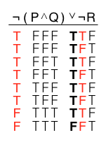
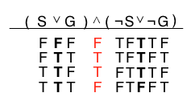
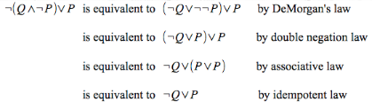
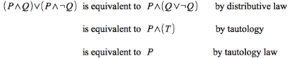
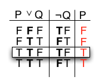
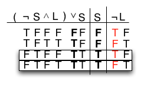

Truth Tables
============

**Example 1**

    ¬(P ∧ Q) ∨ ¬R

Constructing the truth table gives

> 

**Example 2**

    (S ∨ G) ∧ (¬S ∨ ¬G)

Constructing the truth table gives

> 

Logical Equivalence
===================

> **Definition**

> > Two expressions are said to be *logically equivalent* if they have the
> same truth tables.

*Equivalence Laws*

> **DeMorgan\'s Laws** (**and** to **or** and vice versa)
>
> > ¬(*P* ∧ *Q*) is *equivalent* to ¬*P* ∨ ¬*Q*
> >
> > ¬(*P* ∨ *Q*) is *equivalent* to ¬*P* ∧ ¬*Q*
>
> **Commutative Laws** (swap literals)
>
> > *P* ∧ *Q* is *equivalent* to *Q* ∧ *P*
> >
> > *P* ∨ *Q* is *equivalent* to *Q* ∨ *P*
>
> **Associative Laws** (reordering of parentheses)
>
> > *P* ∧ (*Q* ∧ *R*) is *equivalent* to (*P* ∧ *Q*) ∧ *R*
> >
> > *P* ∨ (*Q* ∨ *R*) is *equivalent* to (*P* ∨ *Q*) ∨ *R*
>
> **Distributive Laws** (combinations of **and** and **or**)
>
> > *P* ∧ (*Q* ∨ *R*) is *equivalent* to (*P* ∧ *Q*) ∨ (*P* ∧ *R*)
> >
> > *P* ∨ (*Q* ∧ *R*) is *equivalent* to (*P* ∨ *Q*) ∧ (*P* ∨ *R*)
>
> **Absorption Laws** (elimination of unnecessary literal)
>
> > *P* ∨ (*P* ∧ *Q*) is *equivalent* to *P*
> >
> > *P* ∧ (*P* ∨ *Q*) is *equivalent* to *P*
>
> **Idempotent Laws** (literal identity)
>
> > *P* ∧ *P* is *equivalent* to *P*
> >
> > *P* ∨ *P* is *equivalent* to *P*
>
> **Double Negation Law** (connective reduction)
>
> > ¬¬*P* is *equivalent* to *P*
>
> **Tautology** (always true)
>
> > *P* ∨ ¬*P* is *equivalent to* **T**
>
> **Contradiction** (always false)
>
> > *P* ∧ ¬*P* is *equivalent to* **F**
>
> **Tautology Laws**
>
> > *P* ∧ (tautology) is *equivalent* to *P*
> >
> > *P* ∨ (tautology) is *equivalent* to a (tautology)
> >
> > ¬(tautology) is *equivalent* to a (contradiction)
>
> **Contradiction Laws**
>
> > *P* ∧ (contradiction) is *equivalent* to (contradiction)
> >
> > *P* ∨ (contradiction) is *equivalent* to *P*
> >
> > ¬(contradiction) is *equivalent* to a (tautology)

**Example 3**

    ¬(Q ∧ ¬P) ∨ P

Using the equivalence laws to simplify gives

> 

**Example 4**

    (P ∧ Q) ∨ (P ∧ ¬Q)

Using the equivalence laws to simplify gives

> 

Valid Arguments
===============

> **Definition**

> > An argument is *valid* if assuming that *all* the premises are true, then the conclusion **must** be true.

**REMEMBER**: It is only rows of the truth table where *all* the premise
statements are **true** that the conclusion *must* be **true**.

**Example 5**

    P ∨ Q 
    ¬Q 
    ∴ P

Constructing the truth table gives

> 

The *third* row is the only row where all premises are true and for this
row the conclusion is also true. Thus the argument is **valid**.

**Example 6**

    Either John isn't stupid and he is lazy, or he is stupid.
    John is stupid.
    Therefore, John isn't lazy.

Let

> *S*: "John is stupid."
>
> *L*: "John is lazy."

Then our argument symbolically becomes

    (¬S ∧ L) ∨ S 
    S 
    ∴ ¬L

Constructing the truth table gives

> 

While the *third* row has true premises with a true conclusion, the
*fourth* row also has true premises but a *false* conclusion. Thus this
argument is *invalid*.
