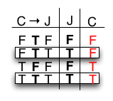
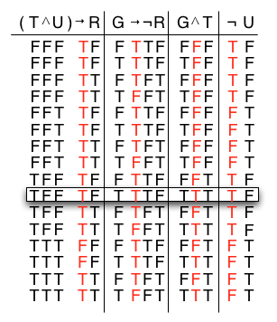

Conditionals (if-then)
======================

> **Alternative forms of if** *P* **then** *Q*
>
> > *P* implies *Q*
> >
> > *Q*, if *P*
> >
> > *P* only if *Q*
> >
> > *P* is a sufficient condition for *Q*
> >
> > *Q* is necessary for *P*

**Example 1**

    If it is snowing, then it is cold.

Equivalent statements would be

> It is snowing implies that it is cold.
> It is cold if it is snowing.
> It is snowing only if it is cold.
> It is snowing is sufficient for it to be cold.
> It is cold is necessary for it to be snowing.

Conditional Laws
================

> **Conditional Laws** (implication to connective)
>
> > *P* → *Q* is *equivalent* to ¬*P* ∨ *Q*
> >
> > *P* → *Q* is *equivalent* to ¬(*P* ∧ ¬*Q*)

**Example 2**

    If you don't turn in the exam, then you will get an F.

> *P*: "You turned in the exam."

> *Q*: "You got an F."

Then symbolically ¬*P* → *Q*. Equivalently, we have ¬(¬*P*) ∨ *Q* ⇒ *P*
∨ *Q* which would be

    Either you turned the exam in, or you got an F.

**Example 3**

Consider the statement

    Either you show up for work, or you lose your job.

> *P*: "You show up for work."

> *Q*: "You keep your job."

Then symbolically *P* ∨ ¬*Q*. Equivalently, we have ¬*P* → ¬*Q* which
would be

    If you don't show up for work, then you will lose your job.

Contrapositive and Converse
===========================

*Contrapositive*

> **Definition**

> > The *contrapositive* of a conditional statement of the form *P* → *Q*
> > is given by ¬*Q* → ¬*P*. A statement is logically equivalent to its
> > contrapositive.

**Example 4**

    If you don't turn in the exam, then you will get an F.

> *P*: "You turned in the exam."

> *Q*: "You got an F."

Then symbolically ¬*P* → *Q*. The contrapositive is ¬*Q* → ¬¬*P* or
equivalently ¬*Q* → *P* giving

    If you did not get an F, then you turned in the exam. 

    (or If you passed the exam, then you turned it in.)

*Converse*

> **Definition**

> > The *converse* of a conditional statement of the form *P* → *Q* is
> > given by *Q* → *P*. A statement is **not** logically equivalent to its
> > converse.

**Example 5**

    If you don't turn in the exam, then you will get an F.

Then symbolically ¬*P* → *Q*. The converse is *Q* → ¬*P* giving

    If you got an F, then you didn't turn in the exam.

Clearly (at least in most classes) you must do more than just turn an
exam in to receive a passing grade, thus the converse is not logically
equivalent.

**Example 6**

    If it is raining, then it is windy and the sun is not shining.

Which of the following statements are logically equivalent:

> (a) It is windy and not sunny only if it is raining.
>
> (b) Rain is a sufficient condition for wind with no sunshine.
>
> (c) Rain is a necessary condition for wind with no sunshine.
>
> (d) Either it is windy only if it is raining, or it is not sunny only
> if it is raining.

> > *R*: "It is raining."

> > *W*: "It is windy."

> > *S*: "The sun is shining."

Then symbolically the original statement is *R* → (*W* ∧ ¬*S*)

> (a) (*W* ∧ ¬*S*) → *R*. By the contrapositive we have ¬*R* → ¬(*W* ∧
> ¬*S*) which is the converse and thus not equivalent to the
> original.
>
> (b) "Sufficient" means implies thus giving *R* → (*W* ∧ ¬*S*) which
> is equivalent to the original.
>
> (c) "Necessary" means reverse implication thus giving (*W* ∧ ¬*S*) →
> ¬*R*. By the contrapositive we have ¬*R* → ¬(*W* ∧ ¬*S*) which is
> the converse and thus not equivalent to the original.
>
> (d) (*W* → *R*) ∨ (¬*S* → *R*). Equivalently
> >
> > (¬*W* ∨ *R*) ∨ (¬¬*S* ∨ *R*)
> >
> > (¬*W* ∨ *R*) ∨ (*S* ∨ *R*)
> >
> > (*R* ∨ ¬*W*) ∨ (*R* ∨ *S*)
> >
> > (*R* ∨ *R*) ∨ (¬*W* ∨ *S*)
> >
> > *R* ∨ (¬*W* ∨ *S*)
> >
> > ¬*R* → (¬*W* ∨ *S*)
> >
> > ¬*R* → ¬(*W* ∧ ¬*S*)
> >
> > which is the converse and thus not equivalent to the original.

Biconditionals (if and only if)
===============================

> **Biconditional Law**
>
> > *P* ↔ *Q* is *equivalent* to (*P* → *Q*) ∧ (*Q* → *P*)

**Example 7**

    If John went to the store then we have eggs, and if he didn't go to the store then we don't.

> *S*: "John went to the store."

> *E*: "We have eggs."

Then symbolically (*S* → *E*) ∧ (¬*S* → ¬*E*). Equivalently by
contrapositive of the second clause (*S* → *E*) ∧ (*E* → *S*) or more
concisely *S* ↔ *E*. Thus in English

    John went to the store if and only if we have eggs.

Conditional Arguments
=====================

**Example 8**

    If Jones was convicted of murdering Smith, then he will go to jail.
    Jones will go to jail.
    Therefore, Jones was convicted of murdering Smith.

> *C*: "Jones was convicted of murdering Smith."

> *J*: "Jones will go to jail."

Symbolically

> *C* → *J*
>
> *J*
>
> ∴ *C*

Constructing a truth table

> 

While the *fourth* row has true premises with a true conclusion, the
*second* row also has true premises but a *false* conclusion. Thus this
argument is *invalid* (afterall Jones may have gone to jail for a
different crime).

**Example 9**

    If the tax rate and the unemployment rate both go up, then there will be a recession.
    The GNP will go up only if there will not be a recession.
    The GNP and taxes are both going up.
    Therefore, the unemployment rate is not going up.

> *T*: "The tax rate will go up."

> *U*: "The unemployment rate will go up."

> *G*: "The GNP will go up."

> *R*: "There will be a recession."

Symbolically

> (*T* ∧ *U*) → *R*
>
> *G* → ¬*R*
>
> *G* ∧ *T*
>
> ∴ ¬*U*

Constructing a truth table

> 

Since the *tenth* row is the only one with all true premises and this
row has a true conclusion, the argument is *valid*.
