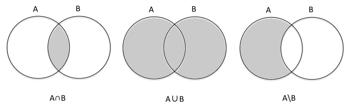
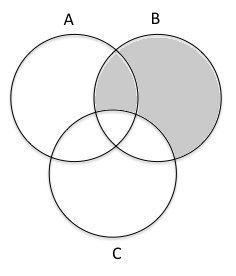
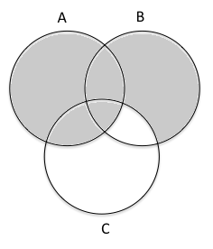
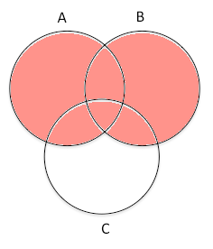
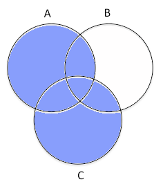
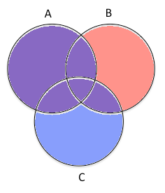
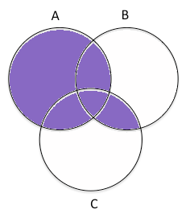

Intersection
============

### **Definition**

> The *intersection* of two sets *A* and *B* denoted *A* ∩ *B* is defined
> as the set

> *A* ∩ *B* = {*x* \| *x* ∈ *A* ∧ *x* ∈ *B*}

In otherwords, for an element to be in the intersection it must be in
*both* sets. Note that the intersection of two sets is a *set*.

**Example 1**

> *A* = {2, 3, 5, 7, 11} *B* = {1, 3, 5, 7, 9}

> Determine *A* ∩ *B*.

We determine the intersection by finding elements that both sets have in
common. Thus

> *A* ∩ *B* = {3, 5, 7}

*Disjoint Sets*

### **Definition**

> Two sets *A* and *B* are said to be *disjoint* if there are no elements
> in their intersection, i.e. the *intersection* of *A* and *B* is the
> *empty set*.
>  
> *A* ∩ *B* = ∅

In other words, disjoint sets have no common elements.

Union
=====

### **Definition**

> The *union* of two sets *A* and *B* denoted *A* ∪ *B* is defined as the
> set

> *A* ∪ *B* = {*x* \| *x* ∈ *A* ∨ *x* ∈ *B*}

In otherwords, for an element to be in the union it must be in *either*
set. Note that the union of two sets is a *set*.

**Example 2**

> *A* = {2, 3, 5, 7, 11} *B* = {1, 3, 5, 7, 9}

> Determine *A* ∪ *B*.

We determine the union by combining all the elements from both sets.
Note that if an element is in *both* sets, that it only appears *once*
in the union. Thus

> *A* ∪ *B* = {1, 2, 3, 5, 7, 9, 11}

Difference
==========

### **Definition**

> The *difference* of two sets *A* and *B* denoted *A* \\ *B* is defined
> as the set

> *A* \\ *B* = {*x* \| *x* ∈ *A* **and** *x* ∉ *B*}

In otherwords, for an element to be in the difference it must be in set
*A* but **not** in set *B*. Note that the difference of two sets is a
*set*.

**Example 3**

> *A* = {2, 3, 5, 7, 11} *B* = {1, 3, 5, 7, 9}

> Determine *A* \\ *B*.

We determine the difference by removing any elements from *A* that are
common to *A* and *B*. Note that if an element is in *B* but not in *A*
that it does not appear in the difference. Thus

> *A* \\ *B* = {2, 11}

Symmetric Difference
====================

### **Definition**

> The *symmetric difference* of two sets *A* and *B* denoted *A* ∆ *B* is
> defined as the set

> *A* ∆ *B* = (*A* \\ *B*) ∪ (*B* \\ *A*) = (*A* ∪ *B*) \\ (*A* ∩ *B*)

In other words, it is the set of elements that are in *either* *A*
**or** *B*, *but* **not** *both* (i.e. *exclusive* **or**).

**Example 4**

> *A* = {2, 3, 5, 7, 11} *B* = {1, 3, 5, 7, 9}

> Determine *A* ∆ *B*.

We determine the symmetric difference by removing the elements in the
intersection from the union. Thus

> *A* ∆ *B* = {1, 2, 9, 11}

Venn Diagrams
=============

### **Definition**

> A *Venn diagram* is a visual representation of sets where circles denote
> the sets and areas of overlap indicate common elements.

The Venn diagrams for the basic set operations are shown below

> 

**Example 5**

> Construct a Venn Diagram for *A* ∪ (*B* \ *C*).

Drawing three overlapping circles we first shade in the area (*B* \ *C*)

> 

Next we shade this area with all of *A* (for union) giving

> 

Note that Venn diagrams are a convenient pictorial way to visualize set
relationships for a small number of sets (usually three or less) but do
not constitute a proof of a set equivalency.

**Example 6**

> Construct a Venn Diagram for (*A* ∪ *B*) ∩ (*A* ∪ *C*).

Drawing three overlapping circles we first shade in the area (*A* ∪ *B*)
in red

> 

Next we shade the area (*A* ∪ *C*) in blue

> 

Overlapping the two areas, we see the intersection in purple

> 

For the final Venn diagram for (*A* ∪ *B*) ∩ (*A* ∪ *C*).

> 

Compare this area to the area for *A* ∪ (*B* ∩ *C*)?

Subsets
=======

### **Definition**

> A set *A* is a *subset* of a set *B*, denoted *A* ⊆ *B*, if *all* the
> elements of *A* are also in *B*, i.e.
 
> *x* ∈ *A* → *x* ∈ *B*

It should be clear from the definition that

> *A* ⊆ *B* is equivalent to *A* ∩ *B* = *A*

**Example 7**

> *A* = {*x* | *x* is a state in the USA} *B* = {*y* | *y* birthplace of
> a US president}

> Is *A* ⊆ *B*? Is *B* ⊆ *A*?

To answer the first question we must determine if all states of the USA
have had a president born in them. To this point, no presidents have
been born in Alaska, so

> *A* ⊈ *B*

For the second question we must determine if each president was born in
a US state. Since natural citizenship is a requirement for being
president (and none have been born in US territories), all the
presidents were born in a US state. Thus

> *B* ⊆ *A*

(Actually many of the first presidents were born before the USA was
formed so technically not all the presidents were born in US states).

Logical Equivalences
====================

Let *U* be the universe of discourse and

> *A* be the truth set for *P(x)*
>
> *B* be the truth set for *Q(x)*

Then there is a direct correspondance between ∨, ∧, and ¬ with ∪, ∩, and
\\ as

> *P(x)* ∨ *Q(x)* ⇔ *A* ∪ *B*
>
> *P(x)* ∧ *Q(x)* ⇔ *A* ∩ *B*
>
> ¬*P(x)* ⇔ *U* \\ *B*

Thus we can use our knowledge of logical equivalences to prove similar
relationships for sets.

**Example 8**

> Show (*A* ∪ *B*) ∩ (*A* ∪ *C*) = *A* ∪ (*B* ∩ *C*)

We begin by writing the logical form of (*A* ∪ *B*) as

> *A* ∪ *B* ⇒ *x* ∈ *A* ∨ *x* ∈ *B*

Likewise for (*A* ∪ *C*)

> *A* ∪ *C* ⇒ *x* ∈ *A* ∨ *x* ∈ *C*

The intersection of these two sets is simply ∧ and by the distributive
law gives

> (*x* ∈ *A* ∨ *x* ∈ *B*) ∧ (*x* ∈ *A* ∨ *x* ∈ *C*)
>
> *x* ∈ *A* ∨ (*x* ∈ *B* ∧ *x* ∈ *C*)

Which in set notation is

> *A* ∪ (*B* ∩ *C*)

Thus set *union* distributes over set *intersection*.

**Example 9**

> Show *A* \\ (*A* ∩ *B*) = *A* \\ *B*

*A* ∩ *B* means

> *x* ∈ *A* ∧ *x* ∈ *B*

Taking the difference with *A* and applying logical equivalences gives

> *x* ∈ *A* ∧ *x* ∉ (*A* ∩ *B*)
>
> *x* ∈ *A* ∧ ¬(*x* ∈ *A* ∧ *x* ∈ *B*)
>
> *x* ∈ *A* ∧ (*x* ∉ *A* ∨ *x* ∉ *B*)
>
> (*x* ∈ *A* ∧ *x* ∉ *A*) ∨ (*x* ∈ *A* ∧ *x* ∉ *B*)
>
> (*x* ∈ *A* ∧ ¬(*x* ∈ *A*)) ∨ (*x* ∈ *A* ∧ *x* ∉ *B*)
>
> (*Contradiction*) ∨ (*x* ∈ *A* ∧ *x* ∉ *B*)
>
> (*x* ∈ *A* ∧ *x* ∉ *B*)

Giving

> *A* \\ *B*

**Theorem**

> For any sets *A* and *B*, (*A* ∪ *B*) \\ *B* ⊆ *A*.

*Proof*

> Let *x* ∈ (*A* ∪ *B*) \\ *B*. Then
>
> (*x* ∈ *A* ∨ *x* ∈ *B*) ∧ *x* ∉ *B*
>
> This statement is logically equivalent to our argument form
>
> *P* ∨ *Q*
>
> ¬*Q*
>
> Which had the valid conclusion *P*. Thus we deduce that *x* ∈ *A*, giving
> (*A* ∪ *B*) \\ *B* ⊆ *A*.
