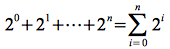
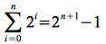
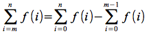
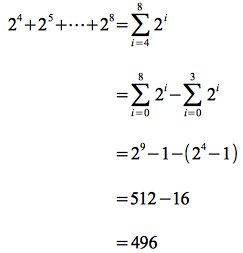
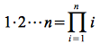

Recursive Functions
===================

> Often we can define a function that depends on a parameter *n* ∈ ℕ
*recursively* as

> *f*(0) = c

> ∀*n* ∈ ℕ, *f*(*n*+1) = *g*(*n*+1) *f*(*n*)

**Example 1**

> Consider the recursive function defined by

> *f*(0) = 1

> ∀*n* ∈ ℕ, *f*(*n*+1) = *f*(*n*) + 2n+1

This recursive function generates the sequence *f*(*n*) = 20 + 21 +
\... + 2n which we have previously seen computes to 2n+1 - 1.

Rather than writing the sequence sum with an ellipsis, instead we
introduce the *summation* notation denoted by Σ. Thus the above sequence
can be written

> 

and thus

> 

Often the limits of summation may not start at 0, thus we can generalize
the summation notation where the index ranges from *m* to *n* (clearly
*m* ≤ *n*) as

> 

Thus if we wished to compute the sum of the powers of 2 from 4 to 8

> 

**Example 2**

> Consider the recursive function defined by

> *f*(0) = 1

> ∀*n* ∈ ℕ, *f*(*n*+1) = (*n*+1) *f*(*n*)

As an example, to compute *f*(5) we would compute

> *f*(5) = 5 ⋅ *f*(4)
>
> > = 5 ⋅ 4 ⋅ *f*(3)
> >
> > = 5 ⋅ 4 ⋅ 3 ⋅ *f*(2)
> >
> > = 5 ⋅ 4 ⋅ 3 ⋅ 2 ⋅ *f*(1)
> >
> > = 5 ⋅ 4 ⋅ 3 ⋅ 2 ⋅ 1 ⋅ *f*(0)
> >
> > = 5 ⋅ 4 ⋅ 3 ⋅ 2 ⋅ 1 ⋅ 1
> >
> > = 120

This function is known as the *factorial* function and is denoted *n*!.
Thus 5! = 120. Similarly to the summation notation, we introduce
*product* notation denoted by Π. Thus the factorial function can be
written (noting that 0! = 1! = 1 and thus we can start the index at 1)

> 

Unfortunately there is no closed form to compute *n*! although there are
approximations.

**Example 3**

> Prove that for *n* ≥ 4, *n*! \> 2n

Since both of these functions are defined recursively (note
exponentiation is simply repeated multiplication) we will attempt to
construct the proof using induction.

*Step 0:* Write the induction given closed form for *n*

> *n*! \> 2n

*Step 1:* Write the induction goal closed form for *n*+1

> (*n* + 1)! \> 2n+1

*Step 2:* Show the induction given is true for a base case

> Clearly for *n* = 4, *n*! = 24 \> 24 = 16.

*Step 3:* Factor the induction goal to include the induction given. **Note:** This is simply the *recursive* formula.

> (*n* + 1)! = (*n* + 1) ⋅ *n*!

*Step 4:* Assume the induction formula from step 0 is true and substitute the closed form solution into step 3.

> Therefore we *assume* *n*! \> 2n. Then

> (*n* + 1) ⋅ *n*! \> (*n* + 1) ⋅ 2n

*Step 5:* Perform any necessary algebra to show the closed form solution from step 1 for *n*+1

> (*n* + 1) ⋅ 2n \> 2 ⋅ 2n     (since (*n* + 1) \> 2 for *n* \> 4)
> > = 2n+1

Thus *n*! \> 2n for *n* ≥ 4.

**Example 4**

> Find a formula for the recursive sequence defined as

> *a*0 = 0
>
> ∀*n* ∈ ℕ, *a*n+1 = 2*a*n + n

Creating a table of values gives

> 
>  *n*    | *a*n |
> ------- | --------------- |
>   0     |         0       |
>   1     | 2⋅0+0=0         |
>   2     | 2⋅0+1=1         |
>   3     | 2⋅1+2=4         |
>   4     | 2⋅4+3=11        |
>   5     | 2⋅11+4=26       |
>   6     | 2⋅26+5=57       |

Hence we can guess a formula of the form *a*n = 2n - (n+1). To prove
this guess is correct we will use induction.

*Step 0:* Write the induction given closed form for *n*

> *a*n = 2n - (n+1)

*Step 1:* Write the induction goal closed form for *n*+1

> *a*n+1 = 2n+1 - ((n+1) + 1) = 2n+1 - (n+2)

*Step 2:* Show the induction given is true for a base case

> For *n* = 0, 20 - (0+1) = 1 - 1 = 0.

*Step 3:* Factor the induction goal to include the induction given. **Note:** This is simply the *recursive* formula

> *a*n+1 = 2*a*n + n

*Step 4:* Assume the induction formula from step 0 is true and substitute the closed form solution into step 3.

> Therefore we *assume* *a*n = 2n - (n+1). Then

> 2*a*n + n = 2(2n - (n+1)) + n

*Step 5:* Perform any necessary algebra to show the closed form solution from step 1 for *n*+1

> 2(2n - (n+1)) + n = 2n+1 - 2*n* - 2 + n
> > = 2n+1 - *n* - 1 - 1
> > 
> > = 2n+1 - (*n*+2)
