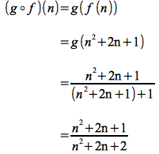
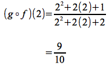

Functions
=========

> **Definition**

> Suppose *f* is a relation from *A* to *B*. Then *f* is known as a
> *function* from *A* to *B* (written *f*: *A* → *B* or *f(a) = b*) if for
> *every* *a* ∈ *A* there is *exactly one* *b* ∈ *B* such that (*a*, *b*)
> ∈ *f*.

> ∀*a* ∈ *A* ∃!*b* ∈ *B* ((*a*, *b*) ∈ *f*).

>**Theorem**

> For two functions *f* and *g* from *A* to *B*, if ∀*a* ∈ *A* (*f(a)* =
> *g(a)*) then *f* = *g*.

**Example 1**

> Determine which of the following relations are functions

> > 1.  *A* = {1, 2, 3}, *B* = {4, 5, 6} and *f* = {(1,5), (2,4), (3,5)}
> > 2.  *A* = {1}, *B* = {4, 5, 6} and *g* = {(1,4), (1,5), (1,6)}
> > 3.  *P* the set of all people and *c* = {(*p*, *q*) ∈ *P* × *P* \| *p*
> > is a parent of *q* }
> > 4.  *l* = {(*x*, *y*) ∈ ℝ × ℝ \| *y* = 2*x* }
> > 5.  *S* the set of students, *P* set of professors, and *a* = {(*s*,
> > *p*) ∈ *S* × *P* \| *s* has *p* as an advisor }

> 1. If we look at the relation *f* we see that for each value from *A*
    there is only *one* value from *B* (even though 5 is the value for
    *two different* values from *A* there is not *one* value from *A*
    that has *two different* values from *B*). Thus *f* is a function.
> 2. Looking at the relation *g*, we see that the value 1 has multiple
    values from *B* and hence *g* is **not** a function.
> 3. Since some parents have multiple children, *c* is **not** a
    function.
> 4. For any real number *x*, there is a unique *y* (found by multiplying
    *x* by 2) and thus *l* is a function. Note: this is the more
    traditional definition of a mathematical function where each *x* has
    only 1 *y*, i.e. vertical line test.
> 5. Typically each student only has one advisor that is a professor, so
    *a* would be a function. Note that if the relation was *s* has *p*
    as a *professor* then it would not be a relation because most
    students have multiple professors.

**Example 2**

> Suppose *f*: *A* → *B* and *R* is a relation on *A*. Define a relation
> *S* on *B* as

> *S* = {(*x*, *y*) ∈ *B* × *B* \| ∃u ∈ *A* ∃*v* ∈ *A*(*f(u)* = *x* ∧
> *f(v)* = *y* ∧ (*u*, *v*) ∈ *R*) }

> Determine

> > 1.  If *R* is reflexive, is *S* reflexive?
> > 2.  If *R* is symmetric, is *S* symmetric?
> > 3.  If *R* is transitive, is *S* transitive?

> 1.  Let *A* = {*a*} and *R* = {(*a*, *a*)} which is trivially reflexive.
    Let *B* = {*b*, *c*} and *f* = {(*a*, *b*)}. Then *S* = {(*b*, *b*)}
    however (*c*, *c*) ∉ *S* and thus *S* is not reflexive.
> 2.  Assume *R* is symmetric and *xSy*. Then there exists a *u* ∈ *A*
    such that *f(u) = x* and *v* ∈ *A* such that *f(v) = y* with *uRv*.
    Since *R* is symmetric, we have *vRu* and thus *ySx* giving *S* is
    symmetric.
> 3.  Let *A* = {1, 2, 3, 4} and *R* = {(1,2), (3,4)} which is vacuously
    transitive (since there are no pairs with (*x*, *y*) ∧ (*y*, *z*)).
    Let *B* = {5, 6, 7} and *f* = {(1, 5), (2, 6), (3, 6), (4, 7)}. Then
    *S* = {(5, 6), (6, 7)}. But clearly *S* is not transitive since it
    does not contain the element (5,7).

Composition
===========

> **Theorem**

> Suppose *f*: *A* → *B* and *g*: *B* → *C*. Then *g* ○ *f* : *A* → *C*
> and (*g* ○ *f*)(*a*) = *g*(*f*(*a*))

**Example 3**

> Let *f*: ℕ → ℕ *f(n)* = *n*2 + 2*n* + 1

> Let *g*: ℕ → ℝ *g(n)* = *n* / (*n* + 1)

> Determine (*g* ○ *f*)(*n*) and find (*g* ○ *f*)(2).

First (*g* ○ *f*)(*n*) = *g*(*f*(*n*)). Hence

> 

For the value *n* = 2

> 

Note alternatively we could have computed *f(2)* = 9 and then *g(9)* =
9/(9+1) = 9/10.
